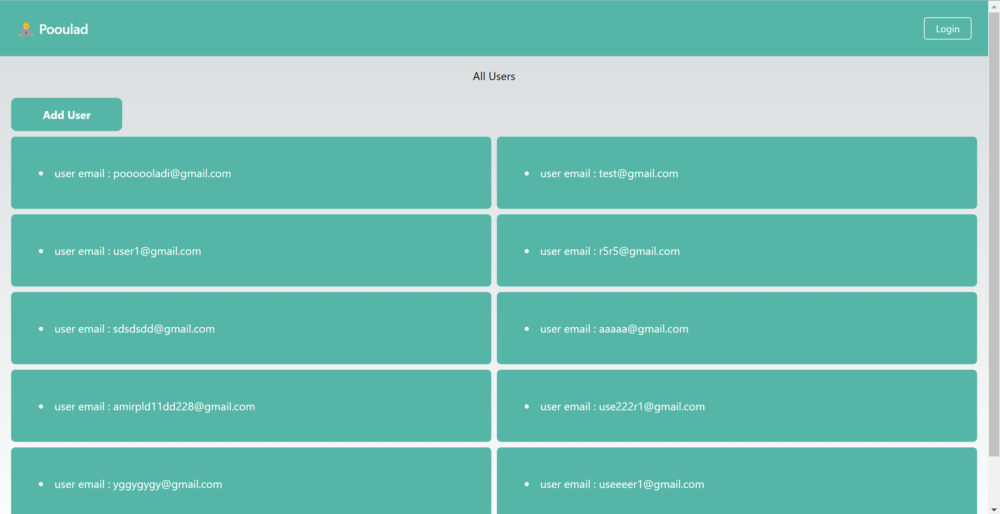
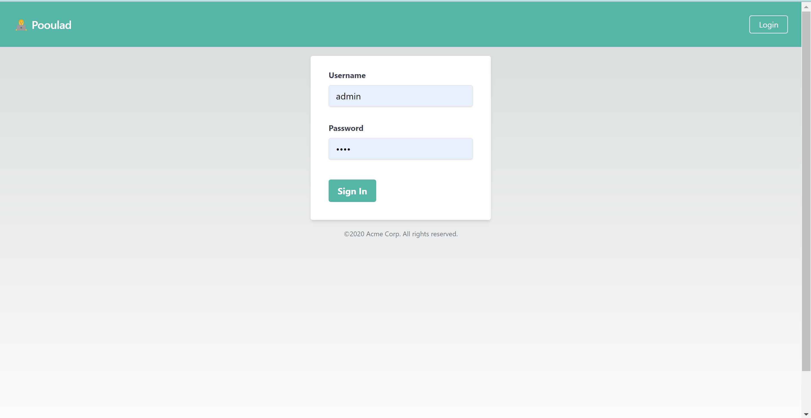
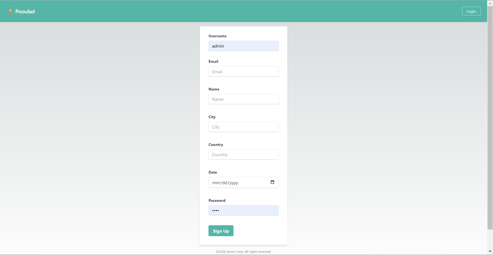

# nextjs-golang-crud-app
🚨Simple full-stack project with nextjs and go-lang

The purpose of creating this project is to learn for junior programmers how to implement a full stack application and create the best structure for the application.


## Technology list in this project

in back-end:
 - Fiber
 - JWT token
 - Validator
 - Godotenv
 - Paginate
 - Postgres
 - GORM


in front-end:
 - React hook form
 - Axios
 - React-loading
 - React-toastify
 - Tailwindcss
 - Typescript


## How to run

In root of source you should run your go project
```bash
  go run main.go
```
In root frontend directory you should run your next project
```bash
  npm install
  npm run dev
```

## API Reference

#### Local address
```bash
  http://127.0.0.1:8080
```
#### All endpoints

```http
  GET /api/users -> get all users
  POST /api/user -> create new user
  PATCH /api/user/:id -> update user
  GET /api/user/:id -> get single user
  DELETE /api/user/:id -> delete user
  POST /api/user -> login
```


## Screenshots





